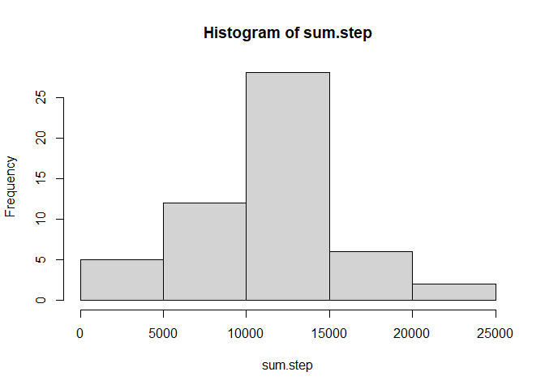

## Loading and preprocessing the data

```r
unzip('activity.zip')
activity <- read.csv('activity.csv')
activity$date <- as.Date(activity$date)
```

## What is mean total number of steps taken per day?

```r
sum.step <- tapply(activity$steps, activity$date, sum)
sum.step <- sum.step[!is.na(sum.step)]
hist(sum.step)
```

<!-- -->


```r
summary(sum.step)
```

```
##    Min. 1st Qu.  Median    Mean 3rd Qu.    Max. 
##      41    8841   10765   10766   13294   21194
```

## What is the average daily activity pattern?


## Imputing missing values


## Are there differences in activity patterns between weekdays and weekends?

