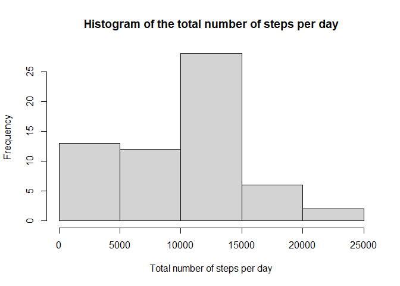
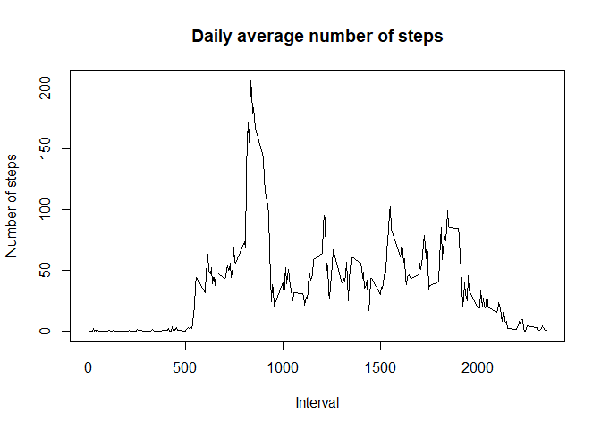
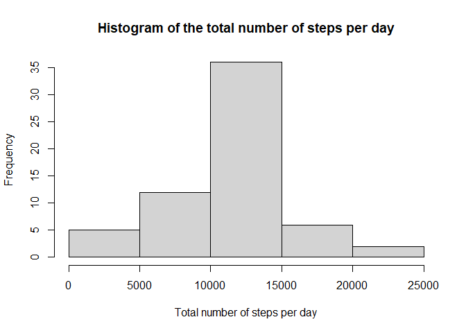

## Loading and preprocessing the data

```r
unzip('activity.zip')
activity <- read.csv('activity.csv')
activity$date <- as.Date(activity$date)
```

## What is mean total number of steps taken per day?
Histogram of the total number of steps per day

```r
total.step <- tapply(activity$steps, activity$date, sum, na.rm=TRUE)
hist(total.step, xlab='Total number of steps per day', main='Histogram of the total number of steps per day')
```

<!-- -->

Mean and Median of the total number of steps per day

```r
summary(total.step)
```

```
##    Min. 1st Qu.  Median    Mean 3rd Qu.    Max. 
##       0    6778   10395    9354   12811   21194
```

## What is the average daily activity pattern?
Plot the daily average number of steps

```r
int.step <- tapply(activity$steps, activity$interval, mean, na.rm=TRUE)
plot(names(int.step), int.step, type='l', xlab='Interval', ylab='Number of steps', main='Daily average number of steps')
```

<!-- -->

Interval time which contains the maximum number of steps

```r
names(int.step[int.step == max(int.step)])
```

```
## [1] "835"
```

## Imputing missing values

Number of missing values

```r
nrow(activity[is.na(activity$steps), ])
```

```
## [1] 2304
```

Fill missing value with the mean for that 5-minute interval

```r
missing <- activity[is.na(activity$steps), ]
avg.steps <- sapply(missing$interval, function(x){ int.step[names(int.step) == x]})
activity[is.na(activity$steps), 'steps'] <- avg.steps
```

Recheck number of missing values

```r
nrow(activity[is.na(activity$steps), ])
```

```
## [1] 0
```

Histogram of the total number of steps per day after imputing missing data

```r
total.step <- tapply(activity$steps, activity$date, sum)
hist(total.step, xlab='Total number of steps per day', main='Histogram of the total number of steps per day')
```

<!-- -->

Mean and Median of the total number of steps taken per day after imputing missing data

```r
summary(total.step)
```

```
##    Min. 1st Qu.  Median    Mean 3rd Qu.    Max. 
##      41    9819   10766   10766   12811   21194
```

## Are there differences in activity patterns between weekdays and weekends?
Create factor variable indicating 'weekday' or 'weekend'

```r
activity$day <- factor(ifelse(weekdays(activity$date) %in% c('Saturday', 'Sunday'), 'weekend', 'weekday'))
```

Plot the daily average number of steps

```r
library(lattice)
int.step <- aggregate(x=activity$steps, by=list(interval=activity$interval, day=activity$day), FUN = mean)
xyplot(int.step$x ~ int.step$interval | int.step$day, type='l', xlab='Interval', ylab='Number of steps', layout=c(1,2))
```

<!-- -->
